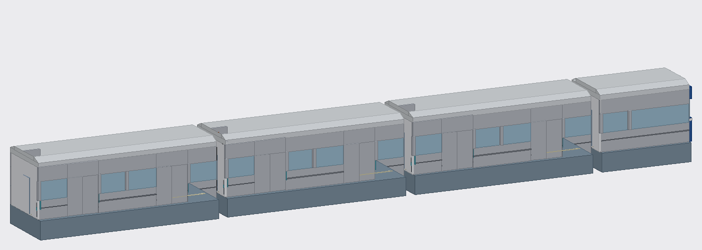

# Endless Subway: ملف الأنيميتور / Animator brief



> **بالعربي تحت، والإنجليزي بعده.** English version below.

---

## بالعربي

### محتاجين منك حاجتين

| # | إيه | الشكل | المدة |
|---|---|---|---|
| 1 | **الصحيان في القطر** (أول اللعبة) | Animation لـ R15 على روبلوكس | 4 لـ 6 ثواني |
| 2 | **حادثة القطر** (لما Level 6 يبدأ) | فيديو MP4 | 6 لـ 8 ثواني (أقصى حاجة 15) |

### 1) الصحيان في القطر

**القصة:** اللاعب نايم في آخر قطر بالليل، وبيصحى لما القطر يقف في المحطة.

- **الـ Rig:** R15 عادي (من Avatar ← Rig Builder في Studio).
- **البداية:** نايم ومائل، وراسه لتحت. كأنه قاعد على الكنبة اللي وراه (نزّل الوسط حوالي 2 stud)، أو نايم واقف وساند على العمود.
- **النص:** يتنفض شوية، ويفتح عينه، ويبص يمين وشمال (القطر واقف والأبواب بتفتح).
- **الآخر:** يقف عادي. لازم آخر فريم يبقى **وقفة Idle طبيعية** عشان اللعب يكمل من غير قفزة.
- **مهم:**
  - مكان الـ HumanoidRootPart لازم يفضل ثابت، والحركة كلها في الجسم.
  - مش Looped، والـ Priority: **Action4**.
  - في نفس الوقت الشاشة بتعمل جفون بتفتح وغمضة (معمولة في الكود)، فخلي **أول 1.5 ثانية** هي لحظة الصحيان نفسها.
- **التسليم:** اعمل Publish للـ Animation من Animation Editor، وابعت الـ **Animation ID**.
  - ⚠️ روبلوكس مبيشغلش Animation غير لو صاحبها هو صاحب اللعبة. فإما تعملها Publish من حساب **DRG1YOUSSIF**، أو تبعت ملف الـ Animation (.rbxm) وهو يعملها Publish.

### 2) حادثة القطر

**القصة (من فكرة اللعبة):** قطر الخط 14، آخر الليل، والركاب نايمين. الحادثة هي الحقيقة اللي اللاعبين هيكتشفوها: القطر عمل حادثة من زمان، وهم كانوا فيه.

**المشاهد المقترحة:**
1. القطر ماشي في النفق، والنور جوه بيرعش.
2. صوت فرامل عالي وشرار من العجل.
3. الخبطة: الشاشة تتهز وتبيض.
4. ضلمة، ونور طوارئ أحمر بيرعش، وصوت إنذار.
5. (اختياري) شاشة أخبار: «عاجل: حادثة قطار الخط 14 - لا ناجين».

- **الشكل:**
  - MP4 بمقاس **1920×1080** و 30fps.
  - **الصوت جوه الفيديو**، لأن الفيديو بيشتغل بصوته.
  - ابعت الفيديو لصاحب اللعبة يرفعه على Creator Hub كـ Video، أو ارفعه انت من حسابه. رفع الفيديو على روبلوكس محتاج حساب متأكد من هويته (ID verified).
- **في اللعبة:** الفيديو بيظهر full screen لمدة `CrashSeconds` (6 ثواني افتراضي، وبتتغير من الإعدادات).

### الملفات اللي معاك

| الملف | استخدامه |
|---|---|
| `models/Train.rbxmx` | القطر كله (3 عربيات + كابينة السواق). Studio: كليك يمين على Workspace ← **Insert from File** |
| `models/Station.rbxmx` | المحطة (الرصيف، والحيطان، والأعمدة، والكراسي، واللافتات) |
| `models/Train.obj` + `.mtl` | القطر لـ **Blender** (File ← Import ← Wavefront). الوحدة stud، فاضرب في **0.28** عشان تبقى متر |
| `models/Station.obj` + `.mtl` | المحطة لـ Blender |
| `../EndlessSubway.rbxlx` | اللعبة كلها، لو عايز تشوف الإضاءة والجو الحقيقي (دوس Play) |

**الأبعاد:**
- القطر ماشي في اتجاه **+X**، وكابينة السواق في الأول (X من 64 لـ 84).
- العربية اللي اللاعبين جواها في النص (X من -20 لـ 20)، والرصيف ناحية **-Z**.
- ارتفاع أرضية القطر = 1 stud، والسقف = 12.

### بعد ما تخلص

صاحب اللعبة بيحط الأرقام في `src/shared/Config.luau`:

```lua
Config.Cutscenes = {
	WakeUpAnimation = "rbxassetid://رقم_الأنيميشن",
	CrashVideo = "rbxassetid://رقم_الفيديو",
	CrashSeconds = 7, -- مدة الفيديو
}
```

لحد ما الحاجات دي تيجي، اللعبة بتستخدم بدائل معمولة في الكود: جفون بتفتح بالنسبة للصحيان، ووميض وهزة وخبر عاجل بالنسبة للحادثة.

---

## English

### Two deliverables

| # | What | Format | Length |
|---|---|---|---|
| 1 | **Waking up on the train** (start of a game) | Roblox R15 animation | 4-6 s |
| 2 | **The train crash** (when level 6 begins) | MP4 video | 6-8 s (15 s max) |

### 1) Waking up

**Story:** the player is asleep on the last train of the night and wakes up as it stops at the station.

- **Rig:** standard R15 (Studio: Avatar > Rig Builder).
- **Start:** asleep and slumped, with the head down. Either sitting on the bench behind (drop the hips about 2 studs) or dozing on your feet against a pole.
- **Middle:** a startled twitch, the eyes open, then looking left and right (the train has stopped and the doors are opening).
- **End:** standing in a **neutral idle pose** on the last frame, so gameplay continues without a pop.
- **Important:**
  - Keep the HumanoidRootPart in place and animate the body only.
  - Not looped, priority **Action4**.
  - The game draws opening eyelids and a blink on screen at the same time, so make the **first 1.5 s** the waking moment.
- **Deliver:** publish from the Animation Editor and send the **animation ID**.
  - ⚠️ Roblox only plays animations owned by the experience owner. Either publish it from the **DRG1YOUSSIF** account, or send the animation (.rbxm) for the owner to publish.

### 2) The crash

**Story (from the game pitch):** the Line 14 train, late at night, with passengers asleep. The crash is the truth the players will discover: the train crashed long ago, and they were on it.

**Suggested beats:**
1. The train in the tunnel, its interior lights flickering.
2. Brakes screeching, with sparks from the wheels.
3. The impact: the screen shakes and goes white.
4. Darkness, a flickering red emergency light and an alarm.
5. (Optional) A news screen: "BREAKING: Line 14 train crash - no survivors".

- **Format:**
  - MP4 at **1920x1080**, 30 fps.
  - **Audio inside the video**, since the video plays with its own sound.
  - Send the file to the owner to upload on Creator Hub as a Video, or upload it from their account. Uploading video to Roblox needs an ID-verified account.
- **In game:** it plays full screen for `CrashSeconds` (6 s by default, adjustable in the settings).

### Files

| File | Use |
|---|---|
| `models/Train.rbxmx` | The whole train (3 cars + driver's cab). In Studio: right-click Workspace > **Insert from File** |
| `models/Station.rbxmx` | The station (platform, walls, pillars, seats, signs) |
| `models/Train.obj` + `.mtl` | The train for **Blender** (File > Import > Wavefront). Units are studs: scale by **0.28** for metres |
| `models/Station.obj` + `.mtl` | The station for Blender |
| `../EndlessSubway.rbxlx` | The full game, to see the real lighting and mood (press Play) |

**Layout:**
- The train heads toward **+X**, with the driver's cab at the front (X 64 to 84).
- The players' car is in the middle (X -20 to 20), and the platform is toward **-Z**.
- The car floor is at Y 1 and the ceiling at Y 12.

### When it's done

The owner puts the IDs into `src/shared/Config.luau`:

```lua
Config.Cutscenes = {
	WakeUpAnimation = "rbxassetid://ANIMATION_ID",
	CrashVideo = "rbxassetid://VIDEO_ID",
	CrashSeconds = 7, -- length of the video
}
```

Until then the game uses built-in stand-ins: opening eyelids for waking up, and flashes, a shake and a news ticker for the crash.
